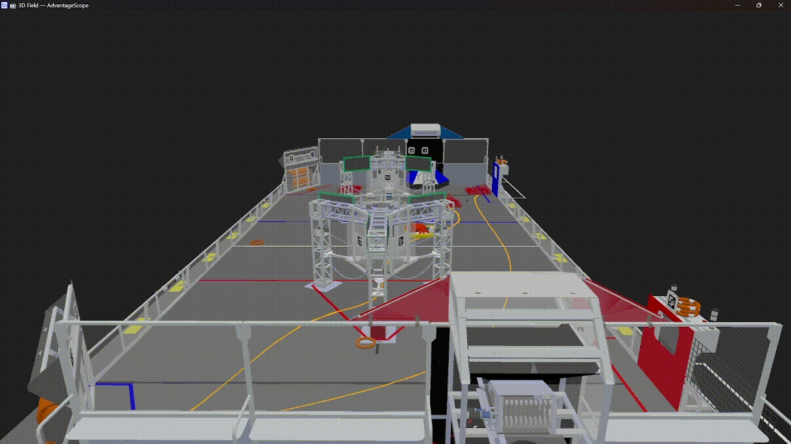

# readme

Status: Done

# The 🍁 Swerve Skeleton

---

Iron Maple’s Swerve Drive Skeleton Project

Vision, Auto-Alignment, Decisive Auto, Advantage-Kit and Digital Twin, all set to go!

<aside>
⚖️ This project is under [GPLv3](https://www.gnu.org/licenses/gpl-3.0.en.html#license-text).

</aside>

## 🕹️Driving

- **250HZ Odometer**, Time-Synchronized with CANFD
- **Field Centric Drive** with custom kinematics.
- **Drive Wheels Feedforward** with a Look-Up-Table.
- **Acceleration Constraining** during TeleOp.
- **Robot Configuration Storage** in JSON files.
- **Robot Status Visualization** through https://github.com/Gold872/elastic-dashboard, https://github.com/Mechanical-Advantage/AdvantageScope, LED and https://github.com/Mechanical-Advantage/NetworkAlerts

## 🤖Auto

- **Decisive Autonomous Framework** with custom auto-follower, allowing robots to “react to its surroundings”.
- **Multiple Path-Planning Tools Selectable**, including https://github.com/mjansen4857/pathplanner, https://github.com/SleipnirGroup/Choreo and https://github.com/team6036/peninsulaportal

## 📝Logging

Built Upon Advantage Kit, everything is logged and recorded for after-match analysis

[GitHub - Mechanical-Advantage/AdvantageKit: Monorepo for robot framework and tools](https://github.com/Mechanical-Advantage/AdvantageKit)

## 👁️Vision

[GitHub - Shenzhen-Robotics-Alliance/FRC-Phantom-Vision: a rapid, powerful, easy-to-use and open-source vision framework for FRC](https://github.com/Shenzhen-Robotics-Alliance/FRC-Phantom-Vision)

- **April-tag Robot Localization** Custom filtering mechanism and odometry calibration algorithm, also compatible with photon-vision.
- **Auto Alignment** command, set-to-go!
- **360° Game-Piece Detection** running on Jetson-Orin-Nano coprocessor.

## 👭Digital-Twin

A complete match simulation, with physics, score-count, human-players and even opponent robots.

- **Uses Actual Robot Code** in the simulator. This means that you can tune Auto-Stages, PIDs, Auto-Scoring functions and more.  The simulator display robots through https://github.com/Mechanical-Advantage/AdvantageScope.
- **Swerve-Drive Physics Simulation**, fine-tuned with experimental data measured in our training field, as well as real-life data gathered from real competitions this year.
    
    
    
- **2D Rigid-Body Collision Simulation** for game-pieces and robots on field.  Using open source 2d physics engine https://github.com/dyn4j/dyn4j.
    
    
    
- **Opponent Robots Simulation** that can either be controlled by a gamepad to play defense or follow pre-stored cycle paths.
    
    